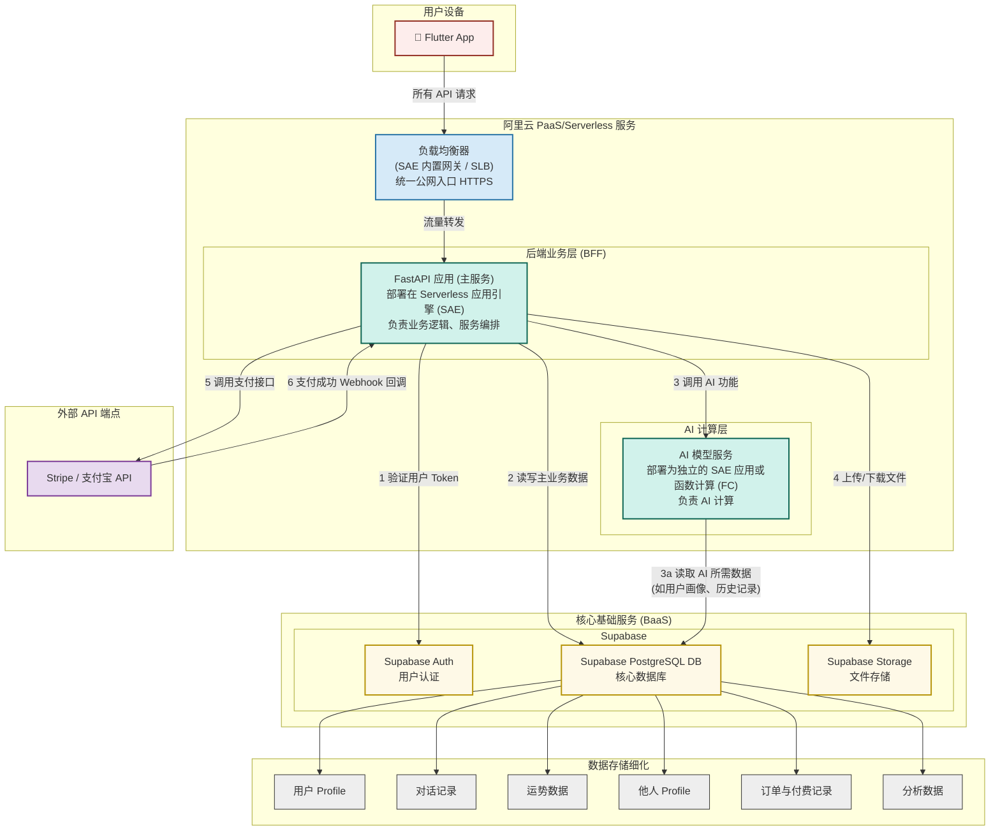

# Aura 系统整体架构

## 1. 架构图

## 2. 各部分介绍

Aura 系统采用现代化的微服务架构，以阿里云 Serverless 服务为基础，Supabase 作为后端基础设施，主要由以下几个核心部分组成：

### 2.1 前端应用 (Flutter App)
*   **描述**：基于 Flutter 框架开发的跨平台移动应用，支持 iOS 和 Android 设备。
*   **职责**：
    *   **用户界面渲染**：展示所有页面、组件和交互元素，提供流畅的用户体验。
    *   **用户输入处理**：接收用户的文本输入、点击操作、手势操作等。
    *   **与 BFF 层交互**：通过 HTTP/HTTPS 请求与后端 FastAPI BFF 服务进行通信。
    *   **本地状态管理**：管理应用内部的临时数据和用户界面状态。
    *   **离线功能**：支持部分功能的离线使用和数据缓存。

### 2.2 负载均衡器 (SAE 内置网关 / SLB)
*   **描述**：阿里云提供的负载均衡服务，作为系统的统一公网入口。
*   **职责**：
    *   **流量分发**：将来自客户端的所有请求均匀分发到后端 FastAPI 服务实例。
    *   **SSL 终结**：处理 HTTPS 加密和解密，确保数据传输安全。
    *   **健康检查**：监控后端服务实例的健康状态，自动移除不健康的实例。
    *   **DDoS 防护**：提供基础的安全防护能力。

### 2.3 后端业务层 (BFF - Backend For Frontend)
*   **描述**：基于 FastAPI 构建的主要后端服务，部署在阿里云 Serverless 应用引擎 (SAE) 上。
*   **职责**：
    *   **业务逻辑编排**：处理复杂的业务流程，协调各个服务之间的调用。
    *   **API 网关功能**：为前端提供统一的 RESTful API 接口。
    *   **认证鉴权**：验证用户 Token，与 Supabase Auth 集成进行用户身份认证。
    *   **数据聚合**：整合来自不同服务的数据，为前端提供优化的数据结构。
    *   **服务调用**：调用 AI 计算服务、Supabase 服务和外部 API。
    *   **错误处理**：统一的错误处理和响应格式化。
    *   **日志记录**：记录详细的业务日志，便于问题排查和性能分析。

### 2.4 AI 计算层 (AI 模型服务)
*   **描述**：专门负责 AI 计算的独立服务，部署为独立的 SAE 应用或函数计算 (FC)。这些服务专注于处理 Aura 产品的核心 AI 逻辑和复杂计算任务。
*   **部署方式**：
    *   **阿里云 SAE**：作为独立的 Java/Python 应用部署，适合需要常驻内存和复杂状态管理的场景。
    *   **阿里云函数计算 (FC)**：用于无状态的 AI 计算任务，具有更好的弹性和成本效益。
*   **技术特点**：
    *   **内置记忆系统**：维护用户会话状态和历史上下文。
    *   **Agent 架构**：以类似 Agent 的结构调用大型语言模型 (LLM) 接口。
    *   **无 GPU 依赖**：主要调用云端 LLM API，不需要本地 GPU 资源。
*   **核心功能**：
    *   **用户画像分析**：根据用户出生信息进行生辰八字、星相基础盘分析。
    *   **运势推算**：结合用户画像和当前时间，推算每日运势。
    *   **对话理解与生成**：NLP 处理用户输入，生成智能响应。
    *   **合盘分析**：分析两个用户的关系匹配度，提供预测和建议。

### 2.5 核心基础服务 (Supabase BaaS)
*   **描述**：Supabase 作为后端基础设施提供商，为整个系统提供数据存储、用户认证和文件存储等基础能力。
*   **核心组件**：
    *   **Supabase Auth (用户认证)**：
        *   负责用户的注册、登录、会话管理、密码重置等功能。
        *   支持多种认证方式，包括邮箱/密码、手机号/OTP，以及第三方 OAuth 提供商（如 Google, Apple 等）。
        *   **优先使用**：Apple OAuth 和 Google OAuth，简化用户注册流程。
        *   提供用户管理 API，与 FastAPI BFF 层集成。
    *   **Supabase PostgreSQL Database**：
        *   核心关系型数据库，所有应用数据都将持久化存储在此。
        *   支持行级安全 (Row Level Security)，提供强大的数据访问控制。
        *   支持实时订阅 (Realtime Subscriptions)，可用于实现实时对话等功能。
        *   **存储内容**：用户 Profile、对话记录、运势数据、他人 Profile、订单与付费记录、以及各种分析数据。
    *   **Supabase Storage (文件存储)**：
        *   高可用、可扩展的对象存储服务，兼容 S3 API。
        *   用于存储用户上传的头像、虚拟形象图片、附件、应用静态资源等非结构化数据。
        *   提供权限控制和 CDN 集成，支持图片压缩和格式转换。

### 2.6 外部 API 端点
*   **描述**：系统需要集成的第三方服务和 API。
*   **核心服务**：
    *   **支付服务**：
        *   **Stripe**：国际信用卡支付，支持多种货币和支付方式。
        *   **支付宝**：针对中文用户的本地化支付解决方案。
        *   **支付流程**：BFF 层调用支付 API，接收 Webhook 回调处理支付结果。
    *   **消息推送服务**：
        *   **Firebase Cloud Messaging (FCM)**：Android 设备推送。
        *   **Apple Push Notification service (APNs)**：iOS 设备推送。
        *   **用途**：每日运势推送、重要提醒、活动通知等。
    *   **AI 大模型 API**：
        *   **OpenAI GPT API**：对话生成和文本处理。
        *   **Claude API**：高质量的对话和分析能力。
        *   **其他 LLM API**：根据成本和效果选择的备选方案。

### 2.7 数据存储细化
*   **描述**：Supabase PostgreSQL Database 中存储的具体数据类型和表结构。
*   **核心表设计**：
    *   **用户 Profile (`profiles`)**：存储用户昵称、性别、出生信息、选定的虚拟形象 ID、Supabase Auth 的用户 ID 等。
    *   **对话记录 (`chat_sessions`, `chat_messages`)**：存储用户与 AI 的每一次对话内容、时间戳、会话管理等。
    *   **运势数据 (`daily_fortunes`)**：存储每日运势计算结果，包括吉凶、宜忌、幸运色、幸运数字、概括性描述等。
    *   **他人 Profile (`other_profiles`)**：存储用户合盘时输入的他人信息（姓名、出生信息等）。
    *   **订单与付费记录 (`transactions`, `user_subscriptions`)**：存储用户的充值、消费、订阅等付费相关数据。
    *   **分析数据 (`analytics_events`)**：用于 BI 和产品分析的原始数据或聚合数据，如用户行为日志、功能使用率等。

## 3. 数据流和交互模式

### 3.1 典型请求流程
1. **用户发起请求**：Flutter App 向阿里云负载均衡器发送 HTTPS 请求
2. **请求路由**：负载均衡器将请求转发给 FastAPI BFF 服务实例
3. **身份验证**：BFF 服务验证用户 Token（调用 Supabase Auth）
4. **业务处理**：根据请求类型进行相应处理
   - **数据查询**：直接从 Supabase Database 读取
   - **AI 功能**：调用 AI 计算服务，AI 服务可能需要读取用户数据
   - **支付操作**：调用外部支付 API
   - **文件操作**：使用 Supabase Storage
5. **响应返回**：BFF 聚合数据并返回给前端

### 3.2 服务间通信
*   **同步调用**：BFF 与 AI 服务、外部 API 之间使用 RESTful API 进行同步通信
*   **异步处理**：支付回调、推送通知等异步操作通过 Webhook 或消息队列处理
*   **数据一致性**：关键业务数据通过数据库事务保证一致性

### 3.3 扩展性和性能
*   **水平扩展**：SAE 支持根据流量自动扩缩容
*   **缓存策略**：在 BFF 层和 AI 服务中实现适当的缓存机制
*   **数据库优化**：通过 Supabase 的连接池和读写分离优化数据库性能 