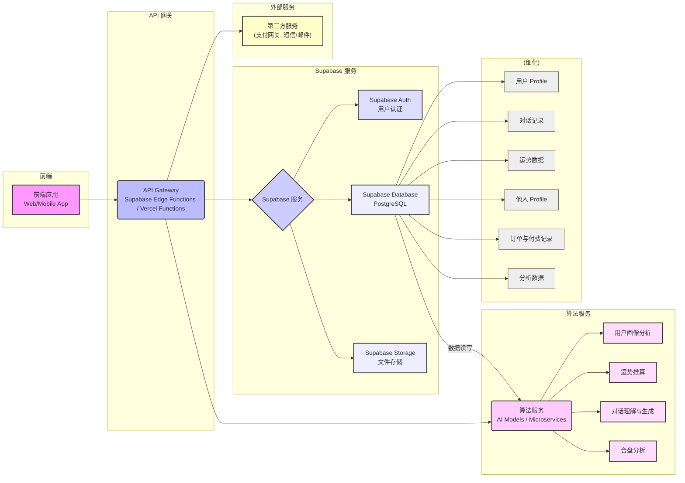

# Aura 系统整体架构

## 1. 架构图

## 2. 各部分介绍

Aura 系统采用模块化和分布式架构，主要由以下几个核心部分组成：

### 2.1 前端应用 (Web/Mobile App)
*   **描述**：用户直接交互的界面，涵盖 Web 浏览器和移动设备（iOS/Android）上的应用程序。
*   **职责**：
    *   **用户界面渲染**：展示所有页面、组件和交互元素。
    *   **用户输入处理**：接收用户的文本输入、点击操作等。
    *   **与 API Gateway 交互**：通过 HTTP/HTTPS 请求与后端 API 进行通信，获取数据、发送指令。
    *   **本地状态管理**：管理应用内部的临时数据和用户界面状态。

### 2.2 API Gateway (Supabase Edge Functions / Vercel Functions)
*   **描述**：作为前端与所有后端服务（Supabase 服务和算法服务）之间的统一入口。它可以是 Supabase 的 Edge Functions，也可以是独立的 Serverless Functions (如 Vercel Functions)。
*   **职责**：
    *   **请求路由**：将前端请求转发到对应的后端服务（Supabase 或算法服务）。
    *   **认证鉴权**：验证用户请求的合法性，确保只有经过认证的用户才能访问受保护的资源。
    *   **数据校验**：对输入数据进行初步校验，减轻后端服务的负担。
    *   **轻量级业务逻辑**：处理一些简单的、无状态的业务逻辑，避免直接暴露核心后端服务。
    *   **日志与监控**：记录请求日志，便于监控和故障排查。

### 2.3 Supabase 服务
*   **描述**：一个强大的开源后端即服务 (BaaS) 平台，提供 PostgreSQL 数据库、认证、存储等多种功能。
*   **核心组件**：
    *   **Supabase Auth (用户认证)**：
        *   负责用户的注册、登录、会话管理、密码重置等功能。
        *   支持多种认证方式，包括邮箱/密码、手机号/OTP，以及第三方 OAuth 提供商（如 Google, Apple, GitHub 等）。**（根据用户指示，将优先使用 Supabase 最便捷的实现方式，包括直接的关联登录）**。
        *   提供用户管理 API，方便对用户进行管理。
    *   **Supabase Database (PostgreSQL)**：
        *   核心关系型数据库，所有应用数据都将持久化存储在此。
        *   支持行级安全 (Row Level Security)，提供强大的数据访问控制。
        *   支持实时订阅 (Realtime Subscriptions)，可用于实现实时对话等功能。
        *   **存储内容**：用户 Profile、对话记录、运势数据、他人 Profile、订单与付费记录、以及各种分析数据。
    *   **Supabase Storage (文件存储)**：
        *   高可用、可扩展的对象存储服务，兼容 S3 API。
        *   用于存储用户上传的头像、虚拟形象图片、附件、应用静态资源等非结构化数据。
        *   提供权限控制和 CDN 集成。

### 2.4 算法服务 (AI Models / Microservices)
*   **描述**：独立部署的微服务集群，专注于处理 Aura 产品的核心 AI 逻辑和复杂计算任务。**这些服务内部包含自己的记忆系统，并以类似 Agent 的结构调用大型语言模型 (LLM) 接口进行处理，通常不涉及 GPU 实例。**它们可以基于 Python 等技术栈构建。
*   **职责**：
    *   **用户画像分析 (User Profile Analysis)**：根据用户输入的出生信息（年、月、日、时、分、秒、出生地）进行分析，推算生辰八字、星相基础盘等用户个性化数据。
    *   **运势推算 (Daily Fortune Calculation)**：结合用户画像、当前日期和时间（包括星相实时位置），推算每日运势（吉凶、宜忌、幸运色、幸运数字、概括性文字描述）。
    *   **对话理解与生成 (Chat Understanding & Generation)**：接收用户输入的对话文本，通过自然语言处理 (NLP) 技术理解用户意图，结合用户历史对话上下文和用户画像，生成 AI 的响应文本，并判断是否需要调用其他算法模块（如运势、合盘）。
    *   **合盘分析 (Compatibility Analysis)**：接收两个或多个用户的 Profile 信息，分析他们之间的关系匹配度，并提供短、中、长期关系预测和建议。
*   **与研发接口**：通过 RESTful API 暴露接口，供 API Gateway 调用。

### 2.5 数据库 (细化 Supabase Database)
*   **描述**：Supabase Database 中存储的具体数据类型。
*   **核心表**：
    *   **用户 Profile**：存储用户昵称、性别、出生信息、选定的虚拟形象 ID、Supabase Auth 的用户 ID 等。
    *   **对话记录**：存储用户与 AI 的每一次对话内容、时间戳、所属对话会话 ID 等。
    *   **运势数据**：存储每日运势计算结果，包括吉凶、宜忌、幸运色、幸运数字、概括性描述等。
    *   **他人 Profile**：存储用户合盘时输入的他人信息（姓名、出生信息等）。
    *   **订单与付费记录**：存储用户的充值、消费、订阅等付费相关数据。
    *   **分析数据**：用于BI和产品分析的原始数据或聚合数据，如用户行为日志、功能使用率等。

### 2.6 外部服务
*   **描述**：系统需要集成的第三方服务。
*   **示例**：
    *   **支付网关 (Payment Gateway)**：Stripe, PayPal 等，处理信用卡、电子支付等。
    *   **短信/邮件服务**：用于发送 OTP 验证码（如果 Supabase Auth 的默认邮件服务不满足需求）、营销邮件或通知短信。
    *   **消息推送服务 (Push Notification Service)**：例如 Firebase Cloud Messaging (FCM) 或 Apple Push Notification service (APNs)，用于向用户推送每日运势、重要提醒等消息。 